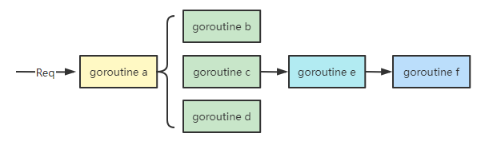

## Context 概要

Go 1.7 标准库引入 Context，中文名为上下文，是一个跨 API 和进程用来传递截止日期、取消信号和请求范围的值的接口。

**context.Context 定义如下：**

```go
type Context interface {
	Deadline() (deadline time.Time, ok bool)
	Done() <-chan struct{}
	Err() error
	Value(key interface{}) interface{}
}
```

+ Deadline()返回一个完成工作的截止时间，表示上下文应该被取消的时间。如果 ok==false 表示没有设置截止时间。

+ Done()返回一个 Channel，这个 Channel 会在当前工作完成时被关闭，表示上下文应该被取消。如果无法取消此上下文，则 Done 可能返回 nil。多次调用 Done 方法会返回同一个 Channel。

+ Err()返回 Context 结束的原因，它只会在 Done 方法对应的 Channel 关闭时返回非空值。如果 Context 被取消，会返回context.Canceled 错误；如果 Context 超时，会返回context.DeadlineExceeded错误。
+ Value()从 Context 中获取键对应的值。如果未设置 key 对应的值则返回 nil。以相同 key 多次调用会返回相同的结果。

**两个创建空 Context 的函数：**

```go
// TODO 返回一个非 nil 但空的上下文。
// 当不清楚要使用哪种上下文或无可用上下文尚应使用 context.TODO。
func TODO() Context

// Background 返回一个非 nil 但空的上下文。
// 它不会被 cancel，没有值，也没有截止时间。它通常由 main 函数、初始化和测试使用，并作为处理请求的顶级上下文。
func Background() Context
```

**四个基于父级创建不同类型 Context 的函数：**

```go
// WithCancel 基于父级创建一个具有 Done channel 的 context
func WithCancel(parent Context) (Context, CancelFunc)

// WithDeadline 基于父级创建一个不晚于 d 结束的 context
func WithDeadline(parent Context, d time.Time) (Context, CancelFunc)

// WithTimeout 等同于 WithDeadline(parent, time.Now().Add(timeout))
func WithTimeout(parent Context, timeout time.Duration) (Context, CancelFunc)

// WithValue 基于父级创建一个包含指定 key 和 value 的 context
func WithValue(parent Context, key, val interface{}) Context
```

##  Context 目的

在 Go 的服务里，通常每来一个请求都会启动若干个goroutine 同时工作：有些执行业务逻辑，有些去数据库拿数据，有些调用下游接口获取相关数据…



协程 a 生 b c d，c 生 e，e 生 f。父协程与子孙协程之间是关联在一起的，他们需要共享请求的相关信息，比如用户登录态，请求超时时间等。如何将这些协程联系在一起，context 应运而生。

要将这些协程关联在一起的原因:  以超时为例，当请求被取消或是处理时间太长，这有可能是使用者关闭了浏览器或是已经超过了请求方规定的超时时间，请求方直接放弃了这次请求结果。此时所有正在为这个请求工作的 goroutine 都需要快速退出，因为它们的“工作成果”不再被需要了。在相关联的 goroutine 都退出后，系统就可以回收相关资源了。

 **Context 的作用是为了在一组 goroutines 间传递上下文信息（cancel signal，deadline，request-scoped value）以达到对它们的管理控制。**

## Context 实现

context 包中定义了 Context 接口后，并且给出了四个实现，分别是：

- emptyCtx
- cancelCtx
- timerCtx
- valueCtx

可以根据不同场景选择使用不同的 Context。

## Context 用法

###  使用建议

一般情况下，使用Background()获取一个空的 Context 作为根节点，有了根结点 Context，便可以根据不同的业务场景选择使用如下四个函数创建对应类型的子 Context。

```go
func WithCancel(parent Context) (ctx Context, cancel CancelFunc)
func WithDeadline(parent Context, deadline time.Time) (Context, CancelFunc)
func WithTimeout(parent Context, timeout time.Duration) (Context, CancelFunc)
func WithValue(parent Context, key, val interface{}) Context
```

1.不要将 Context 塞到结构体里；直接将 Context 类型作为函数的第一参数，且命名为 ctx。

2.不要向函数传入一个 nil Context，如果你实在不知道传哪个 Context 请传 context.TODO。

3.不要把本应该作为函数参数的数据放到 Context 中传给函数，Context 只存储请求范围内在不同进程和 API 间共享的数据（如登录信息 Cookie）。

4.同一个 context 可能会被传递到多个 goroutine，别担心，context 是并发安全的。

### 传递共享的数据


现实场景中可能是从一个 HTTP 请求中获取到 Request-ID。所以，下面这个样例可能更适合：

```go
const requestIDKey int = 0

// 中间件：提取 Request ID 并注入上下文
func WithRequestID(next http.Handler) http.Handler {
    return http.HandlerFunc(
        func(rw http.ResponseWriter, req *http.Request) {
            // 从 header 中提取 request-id
            reqID := req.Header.Get("X-Request-ID")
            // 创建 valueCtx。使用自定义的类型，不容易冲突
            ctx := context.WithValue(
                req.Context(), requestIDKey, reqID)

            // 创建新的请求
            req = req.WithContext(ctx)
    
            // 调用 HTTP 处理函数
            next.ServeHTTP(rw, req)
        }
    )

}

// 从上下文中获取 Request ID
// 获取 request-id
func GetRequestID(ctx context.Context) string {
    ctx.Value(requestIDKey).(string)
}

// 处理请求
func Handle(rw http.ResponseWriter, req *http.Request) {
    reqID, ok := GetRequestID(req.Context())
    if !ok {
        reqID = "unknown" // 处理缺失的情况
    }
    // 继续处理请求，例如记录日志
    rw.Write([]byte("Request ID: " + reqID))
}

func main() {
    handler := WithRequestID(http.HandlerFunc(Handle))
    http.ListenAndServe("/", handler)
}
```

### 取消 goroutine

Context 的作用是为了在一组 goroutine 间传递上下文信息，其中便包括取消信号。取消信号可用于通知相关的 goroutine 终止执行，避免无效操作。

设想一个场景：打开外卖的订单页，地图上显示外卖小哥的位置，而且是每秒更新 1 次。客户端向后台发起 WebSocket 连接请求后，后台启动一个协程，每隔 1 秒计算 1 次小哥的位置，并发送给客户端（现实中可能是轮询）。如果用户退出此页面，则后台需要“取消”此过程，退出 goroutine，系统回收资源。

后端可能的实现如下：

```go
func Perform() {
    for {
        calculatePos()
        sendResult()
        time.Sleep(time.Second)
    }
}
```


如果需要实现“取消”功能，并且在不了解 Context 功能的前提下，可能会这样做：给函数增加一个指针型 bool 变量，在 for 语句的开始处判断 bool 变量是发由 true 变为 false，如果改变，则退出循环。

上面给出的简单做法，可以实现想要的效果，但是并不优雅。并且一旦通知的信息多了之后，函数入参就会臃肿复杂。优雅的做法是使用 Context。

```go
func Perform(ctx context.Context) {
    for {
        calculatePos()
        sendResult()

        select {
        case <-ctx.Done():
            // 被取消，直接返回
            return
        case <-time.After(time.Second):
            // block 1 秒钟 
        }
    }

}
```

主流程可能是这样的：

```go
ctx, cancel := context.WithTimeout(context.Background(), time.Hour)
go Perform(ctx)

// ...
// 收到 App 端退出页面的通知，调用 cancel 函数。
cancel()
```


注意一个细节，WithTimeout 函数返回的 Context 和 CancelFunc 是分开的。Context 本身并没有取消函数，这样做的原因是取消函数只能由外层函数调用，防止子结点 Context 调用取消函数，从而严格控制信息的流向：由父结点 Context 流向子结点 Context。

###  防止 goroutine 泄漏

前面那个例子里，goroutine 还是会自己执行完，最后返回，只不过会多浪费一些系统资源。这里给出一个如果不用 context 取消，goroutine 就会泄漏的例子（源自Using contexts to avoid leaking goroutines）。

```go
// gen 是一个整数生成器且会泄漏 goroutine
func gen() <-chan int {
    ch := make(chan int)
    go func() {
        var n int
        for {
            ch <- n
            n++
            time.Sleep(time.Second)
        }
    }()
    return ch
}
```

上面的生成器会启动一个具有无限循环的 goroutine，调用者会从信道这些值，直到 n 等于 5。

```
for n := range gen() {
    fmt.Println(n)
    if n == 5 {
        break
    }
}
```

当 n == 5 的时候，直接 break 掉。那么 gen 函数的协程就会无限循环，永远不会停下来。发生了 goroutine 泄漏。

我们可以使用 Context 主动通知 gen 函数的协程停止执行，阻止泄漏。

```go
func gen(ctx context.Context) <-chan int {
	ch := make(chan int)
	go func() {
		var n int
		for {
			select {
			case <-ctx.Done():
				return // 当 ctx 结束时避免 goroutine 泄漏
			case ch <- n:
				n++
			}
		}
	}()
	return ch
}
```

现在，调用方可以在完成后向生成器发送信号。调用 cancel 函数后，内部 goroutine 将返回。

```go
ctx, cancel := context.WithCancel(context.Background())
defer cancel() // make sure all paths cancel the context to avoid context leak

for n := range gen(ctx) {
    fmt.Println(n)
    if n == 5 {
        cancel()
        break
    }
}

// ...
```


参考:

+ [Go Context 详解之终极无惑](https://blog.csdn.net/K346K346/article/details/122589609)

